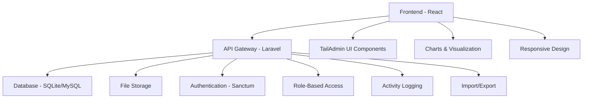
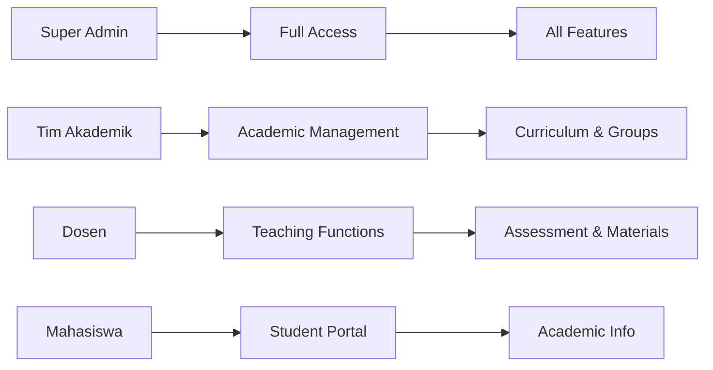

<div align="center">
  <h1 align="center">🎓 Sistem Akademik UMJ</h1>
  <p align="center">
    <strong>Comprehensive Academic Management System for Universitas Muhammadiyah Jakarta</strong>
  </p>
  
  
  
  <br/><br/>
  
  <div align="center">
    <a href="https://laravel.com">
      
    </a>
    <a href="https://reactjs.org">
      
    </a>
    <a href="https://www.typescriptlang.org">
      
    </a>
    <a href="https://tailwindcss.com">
      
    </a>
    <a href="https://tailadmin.com">
      
    </a>
  </div>
  
  <br/>
  
  <div align="center">
    <a href="https://github.com/arkannaufl/sistem-akademik-umj/issues">
      
    </a>
    <a href="https://github.com/arkannaufl/sistem-akademik-umj/stargazers">
      
    </a>
    <a href="https://github.com/arkannaufl/sistem-akademik-umj/network/members">
      
    </a>
    <a href="LICENSE">
      
    </a>
  </div>
</div>

## 📋 Deskripsi

> **Sistem Akademik UMJ** adalah aplikasi web komprehensif yang dirancang untuk mengelola seluruh aspek akademik di Universitas Muhammadiyah Jakarta. Sistem ini mendukung manajemen kurikulum berbasis blok, Problem Based Learning (PBL), Case Study Review (CSR), penjadwalan akademik, absensi, penilaian, dan pelaporan yang terintegrasi.

### 🎯 **Key Highlights**
- 🏫 **University-Grade**: Built specifically for Universitas Muhammadiyah Jakarta
- 🎨 **Modern UI**: Based on [TailAdmin React](https://tailadmin.com/) professional dashboard template
- 🔐 **Multi-Role System**: 4 distinct user roles with granular permissions
- 📊 **Real-time Analytics**: Comprehensive dashboard with live data visualization
- 📱 **Responsive Design**: Optimized for desktop, tablet, and mobile devices
- 🔄 **Import/Export**: Bulk data management with Excel integration

## ✨ Fitur Utama

### 🎯 Manajemen Akademik
- **Kurikulum Berbasis Blok**: Pengelolaan mata kuliah dengan sistem blok semester
- **PBL (Problem Based Learning)**: Manajemen modul PBL dengan penugasan dosen dan kelompok
- **CSR (Case Study Review)**: Sistem review kasus dengan penjadwalan dan penilaian
- **Penjadwalan Terintegrasi**: Kuliah besar, praktikum, jurnal reading, dan agenda khusus
- **Manajemen Kelompok**: Kelompok besar dan kecil dengan sistem semester reguler dan antara

### 👥 Manajemen Pengguna
- **Multi-Role System**: 4 level akses (Super Admin, Tim Akademik, Dosen, Mahasiswa)
- **Role-Based Access Control**: Setiap role memiliki akses dan fitur yang berbeda
- **Import Data Massal**: Import dosen, mahasiswa, dan tim akademik via Excel
- **Manajemen Profil**: Update profil, avatar, dan informasi personal

### 📊 Monitoring & Analytics
- **Dashboard Real-time**: Statistik akademik, kehadiran, dan penilaian
- **Sistem Absensi**: Tracking kehadiran untuk PBL, CSR, dan jurnal reading
- **Penilaian Terintegrasi**: Sistem penilaian PBL dan jurnal dengan export laporan
- **Pelaporan Komprehensif**: Export data dalam format Excel dan PDF

### 🔧 Fitur Teknis
- **File Management**: Upload dan download RPS, materi kuliah, dan dokumen
- **Notification System**: Notifikasi real-time untuk penugasan dan jadwal
- **Activity Logging**: Pencatatan aktivitas pengguna dengan Spatie Activity Log
- **Backup & Restore**: Sistem backup otomatis dan restore data
- **Responsive Design**: Interface yang optimal di desktop dan mobile

## 🛠️ Tech Stack

### Backend
- **Framework**: Laravel 12.x
- **PHP**: 8.2+
- **Database**: SQLite (default), MySQL, PostgreSQL
- **Authentication**: Laravel Sanctum
- **Key Packages**:
  - Spatie Laravel Permission (Role & Permission)
  - Spatie Laravel Activity Log (Activity Tracking)
  - Maatwebsite Excel (Import/Export)
  - Jenssegers Agent (Device Detection)

### Frontend
- **Framework**: React 18.x dengan TypeScript
- **UI Template**: [TailAdmin React](https://tailadmin.com/) - Professional Admin Dashboard
- **Styling**: TailwindCSS 4.x, Material-UI
- **UI Components**: Headless UI, React Icons
- **Charts & Visualization**: ApexCharts, Recharts
- **Calendar**: FullCalendar
- **File Handling**: ExcelJS, jsPDF, html2canvas
- **Build Tool**: Vite

### Development Tools
- **Package Manager**: Composer (PHP), npm (Node.js)
- **Code Quality**: ESLint, Laravel Pint
- **Testing**: PHPUnit
- **Version Control**: Git

## 🚀 Quick Start

### 📋 Prerequisites

| Requirement | Version | Description |
|-------------|---------|-------------|
| **PHP** | 8.2+ | Backend runtime environment |
| **Composer** | Latest | PHP dependency manager |
| **Node.js** | 18+ | Frontend runtime environment |
| **npm** | Latest | Node package manager |
| **Database** | Any | SQLite (default), MySQL, or PostgreSQL |

### ⚡ One-Click Setup

```bash
# 1. Clone repository
git clone https://github.com/arkannaufl/sistem-akademik-umj.git
cd sistem-akademik-umj

# 2. Setup Backend (Laravel)
cd backend
composer install
cp .env.example .env
php artisan key:generate
php artisan migrate --seed
php artisan storage:link
php artisan serve &

# 3. Setup Frontend (React)
cd ../frontend
npm install
npm run dev
```

### 🔧 Manual Setup

<details>
<summary><strong>📦 Backend Setup (Laravel)</strong></summary>

```bash
# Masuk ke direktori backend
cd backend

# Install dependencies
composer install

# Copy environment file
cp .env.example .env

# Generate application key
php artisan key:generate

# Konfigurasi database di .env
# DB_CONNECTION=sqlite (default)
# atau
# DB_CONNECTION=mysql
# DB_HOST=127.0.0.1
# DB_PORT=3306
# DB_DATABASE=your_database_name
# DB_USERNAME=your_username
# DB_PASSWORD=your_password

# Jalankan migrasi dan seeder
php artisan migrate --seed

# Buat symbolic link untuk storage
php artisan storage:link

# Jalankan server Laravel
php artisan serve
```

</details>

<details>
<summary><strong>⚛️ Frontend Setup (React)</strong></summary>

```bash
# Masuk ke direktori frontend
cd frontend

# Install dependencies
npm install

# Setup environment (Development)
npm run setup:dev

# Jalankan development server
npm run dev

# Atau untuk production
npm run setup:prod
npm run build:prod
```

</details>

### 🌐 Access Application

| Service | URL | Description |
|---------|-----|-------------|
| **Frontend** | http://localhost:5173 | React application (dev) |
| **Backend API** | http://localhost:8000 | Laravel API (dev) |
| **API Docs** | http://localhost:8000/api | API documentation (dev) |
| **Production** | https://isme.fkkumj.ac.id | Live application |

### 🔑 Default Credentials

| Role | Username | Password |
|------|----------|----------|
| **Super Admin** | `admin` | `password` |
| **Tim Akademik** | `tim_akademik` | `password` |
| **Dosen** | `dosen` | `password` |
| **Mahasiswa** | `mahasiswa` | `password` |

## 📁 Project Structure

```
sistem-akademik-umj/
├── 📁 backend/                    # Laravel API Backend
│   ├── 📁 app/
│   │   ├── 📁 Http/Controllers/   # API Controllers (39 files)
│   │   ├── 📁 Models/            # Eloquent Models (30+ files)
│   │   ├── 📁 Imports/           # Excel Import Classes
│   │   └── 📁 Services/          # Business Logic Services
│   ├── 📁 database/
│   │   ├── 📁 migrations/        # Database Migrations (48 files)
│   │   └── 📁 seeders/          # Database Seeders
│   ├── 📁 routes/
│   │   └── 📄 api.php           # API Routes
│   └── 📁 config/               # Configuration Files
├── 📁 frontend/                   # React Frontend (TailAdmin-based)
│   ├── 📁 src/
│   │   ├── 📁 components/        # Reusable Components (20 files)
│   │   ├── 📁 pages/            # Page Components (39 files)
│   │   ├── 📁 context/          # React Context (3 files)
│   │   ├── 📁 hooks/            # Custom Hooks
│   │   ├── 📁 icons/            # SVG Icons (59 files)
│   │   └── 📁 utils/            # Utility Functions
│   └── 📁 public/               # Static Assets
└── 📄 README.md
```

### 🏗️ Architecture Overview



## 👥 User Roles & Permissions

| Role | Description | Key Features |
|------|-------------|--------------|
| **🔧 Super Admin** | System administrator with full access | • Manage academic years & semesters<br>• User management (all roles)<br>• System configuration & backup<br>• Access to all features & reports |
| **📚 Tim Akademik** | Academic team with curriculum management | • Course & curriculum management<br>• PBL & CSR instructor assignment<br>• Student group management<br>• Attendance & assessment monitoring<br>• Academic report generation |
| **👨‍🏫 Dosen** | Faculty members with teaching responsibilities | • View teaching schedules<br>• Input attendance & assessments<br>• Upload course materials & RPS<br>• View assignment history<br>• Receive assignment notifications |
| **🎓 Mahasiswa** | Students with academic access | • View class schedules<br>• Check grades & attendance<br>• Download course materials<br>• View academic information |

### 🔐 Permission Matrix



## 🔧 Konfigurasi

### Environment Variables (Backend)
```env
APP_NAME="Sistem Akademik UMJ"
APP_ENV=local
APP_KEY=base64:your-app-key
APP_DEBUG=true
APP_URL=https://isme.fkkumj.ac.id

DB_CONNECTION=sqlite
DB_DATABASE=/path/to/database.sqlite

SANCTUM_STATEFUL_DOMAINS=localhost:5173
```

### API Configuration (Frontend)
```typescript
// src/utils/api.ts - Centralized API configuration
export const BASE_URL = import.meta.env.VITE_API_URL || 'http://localhost:8000';
export const API_BASE_URL = `${BASE_URL}/api`;
```

### Environment Files (Frontend)
- `env.development` - Development environment (localhost:8000)
- `env.production` - Production environment (isme.fkkumj.ac.id)
- `env.example` - Template environment file

**Quick Setup:**
```bash
# Development
npm run setup:dev

# Production  
npm run setup:prod
```

## 📊 Database Schema

### Core Tables
- `users` - Data pengguna (dosen, mahasiswa, admin)
- `mata_kuliah` - Data mata kuliah dan kurikulum
- `kelas` - Data kelas mahasiswa
- `kelompok_besar` - Kelompok besar mahasiswa
- `kelompok_kecil` - Kelompok kecil mahasiswa
- `ruangan` - Data ruangan dan fasilitas

### Academic Tables
- `pbls` - Data modul PBL
- `csrs` - Data CSR dan case study
- `jadwal_*` - Berbagai jenis jadwal akademik
- `absensi_*` - Data absensi per jenis kegiatan
- `penilaian_*` - Data penilaian dan nilai

## 🚀 Deployment

### Production Setup
```bash
# Backend
cd backend
composer install --optimize-autoloader --no-dev
php artisan config:cache
php artisan route:cache
php artisan view:cache
php artisan migrate --force

# Frontend
cd frontend
npm run build
```

### Docker Deployment (Optional)
```dockerfile
# Dockerfile untuk backend
FROM php:8.2-fpm
# ... konfigurasi Docker
```

## 🤝 Contributing

1. Fork repository ini
2. Buat feature branch (`git checkout -b feature/AmazingFeature`)
3. Commit perubahan (`git commit -m 'Add some AmazingFeature'`)
4. Push ke branch (`git push origin feature/AmazingFeature`)
5. Buat Pull Request

## 📝 Changelog

### v1.0.0 (Current)
- ✅ Sistem manajemen akademik lengkap
- ✅ Multi-role authentication
- ✅ PBL dan CSR management
- ✅ Penjadwalan terintegrasi
- ✅ Sistem absensi dan penilaian
- ✅ Dashboard analytics
- ✅ Import/export data

## 🐛 Bug Reports & Feature Requests

Jika Anda menemukan bug atau memiliki saran fitur, silakan buat [issue](https://github.com/arkannaufl/sistem-akademik-umj/issues) baru.

## 📄 License

This project is licensed under the [MIT License](LICENSE).

### 📋 Third-Party Licenses

| Component | License | Description |
|-----------|---------|-------------|
| **Laravel Framework** | MIT | PHP web application framework |
| **React** | MIT | JavaScript library for building user interfaces |
| **TailAdmin React** | [TailAdmin License](https://tailadmin.com/) | Professional admin dashboard template |
| **TailwindCSS** | MIT | Utility-first CSS framework |
| **Material-UI** | MIT | React components implementing Material Design |

> **Note**: This project uses [TailAdmin React](https://tailadmin.com/) as the base UI template. Please ensure compliance with their licensing terms for commercial use.

## 👨‍💻 Developer

**Arkan Naufal**
- GitHub: [@arkannaufl](https://github.com/arkannaufl)
- Email: arkannaufal024@gmail.com

**Rizqi Irkham**
- GitHub: [@rizqiirkhamm](https://github.com/rizqiirkhamm)
- Email: rizqiirkhammaulana@gmail.com

**Faris Dzu**
- GitHub: [@farisdzu](https://github.com/farisdzu)
- Email: farisdzu9@gmail.com

**Azka Savir**
- GitHub: [@azkasavir](https://github.com/azkasavir)
- Email: azkasavir@gmail.com

## 🙏 Acknowledgments

- Universitas Muhammadiyah Jakarta
- [TailAdmin](https://tailadmin.com/) - React Admin Dashboard Template
- Laravel Community
- React Community
- Semua kontributor yang telah membantu pengembangan sistem ini

---

<div align="center">
  <h3>🌟 Star this repository if you found it helpful!</h3>
  
  <p>
    <a href="https://github.com/arkannaufl/sistem-akademik-umj/stargazers">
      
    </a>
    <a href="https://github.com/arkannaufl/sistem-akademik-umj/network/members">
      
    </a>
  </p>
  
  <p>
    <a href="https://github.com/arkannaufl/sistem-akademik-umj/issues">🐛 Report Bug</a> •
    <a href="https://github.com/arkannaufl/sistem-akademik-umj/issues">💡 Request Feature</a> •
    <a href="https://github.com/arkannaufl/sistem-akademik-umj/discussions">💬 Discussions</a>
  </p>
  
  <hr/>
  
  <p>© 2025 Sistem Akademik UMJ. All rights reserved.</p>
  
</div>
